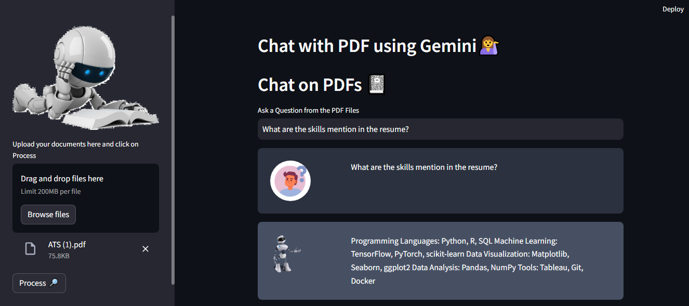

# Chat with PDFs using Gemini 💬📄

This Streamlit app allows you to chat with PDF documents using the Gemini conversational AI model. Simply upload your PDF files, ask questions related to the content, and receive detailed answers based on the provided context.

## Features

- Upload multiple PDF documents for analysis.
- Ask questions about the content of the PDFs.
- Receive detailed answers generated by the Gemini conversational AI model.
- View chat history to track previous interactions.

## How to Use

1. Upload your PDF documents using the file uploader.
2. Ask questions related to the content of the uploaded PDFs in the text input field.
3. Click on the "Process" button to analyze the PDFs and generate responses.
4. View the chat history to see previous interactions.

## Installation

1. Clone the repository.
2. Install the required dependencies by running `pip install -r requirements.txt`.
3. Set up your Google API key by creating a `.env` file and adding `GOOGLE_API_KEY=<your_api_key>`.
4. Run the app using `streamlit run app.py`.

## Dependencies

- Streamlit
- PyPDF2
- langchain
- google.generativeai
- dotenv

